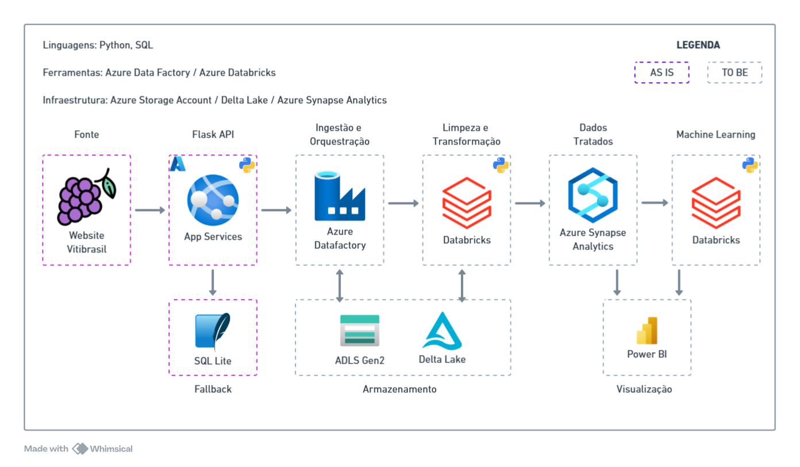

# 🍇 API Vitibrasil
Pos Tech - Machine Learning Engineering

Challenge 01 - API pública de consulta nos dados do site Vitibrasil

A API funciona como uma interface de consulta do site, facilitando o seu uso por meio de estruturas de dados (Pipelines, Notebooks, etc.).

## 🌐 Links

API: https://postechchallenge01-badpbzdsbmdaazg2.eastus2-01.azurewebsites.net/

Site Vitibrasil: http://vitibrasil.cnpuv.embrapa.br/index.php

Link Video Explicativo: https://www.youtube.com/watch?v=Ppsfe5duSgQ

## ⚙️ Stack Usada

Python - Flask, JWT, Swagger, SQLAlchemy

## 🚀 Funcionalidades
- Autenticação: JWT usando Bearer Token
- Web Scraping: Extração de dados das páginas do site da Vitibrasil
- Banco de dados: Para armazenar os dados da consulta, facilitando o tempo de resposta caso um dado já tenha sido consultado.
- Documentação: Via Swagger

## 📁 Estrutura de Pastas

```
├── ./
│   ├── app.py
│   ├── config.py
│   ├── .github/
│   │   ├── workflows/
│   ├── auth/
│   │   ├── jwt_handlers.py
│   ├── docs/
│   ├── instance/
│   ├── modules/
│   │   ├── database/
│   │   │   ├── db_config.py
│   │   │   ├── functions.py
│   │   │   ├── models.py
│   │   ├── webscraping/
│   │   │   ├── webscraping.py
│   ├── routers/
│   │   ├── auth.py
│   │   ├── comercializacao.py
│   │   ├── exportacao.py
│   │   ├── importacao.py
│   │   ├── processamento.py
│   │   ├── producao.py
│   ├── services/
│   │   ├── data_featcher.py
│   │   ├── validators.py
```
- `app.py` - Aplicativo principal
- `config.py` - Configuração de constantes da aplicação
- `github/` - Automação de deploy
- `auth/` - Tratamentos de mensagens do JWT
- `docs/` - Documentação do Challenge e imagens
- `instance/` - Instância do banco de dados
- `modules/`
    - `database/` - Estruturação do banco de dados
    - `webscraping/` - Extração de dados do site
- `routers/` - Rotas da aplicação
- `services/` - Funções ou classes que oferecem suporte às rotas

## 💻 Execute o Projeto

### 1. Clone o repositório

```
git clone https://github.com/gabsouusa/postechchallenge01
```

### 2. Instale a versão do Python 3.13.3

```
https://www.python.org/ftp/python/3.13.3/python-3.13.3-amd64.exe
```

### 3. Ative a venv e instale as bibliotecas

```cmd
python -m venv venv
venv/Scripts/activate
pip install -r requirements.txt
```

## 4. Execute a aplicação

```cmd
python app.py
```

## 📕 Documentação

A documentação das rotas está disponível no Swagger

Link: https://postechchallenge01-badpbzdsbmdaazg2.eastus2-01.azurewebsites.net/apidocs

## 🧩 Arquitetura API

