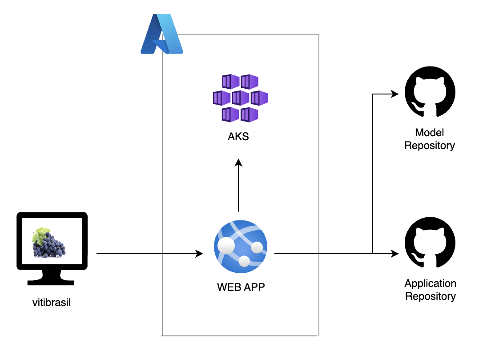

# PosTechChallenge
Pos Tech - Machine Learning Engineering

Challenge 01 - API pública de consulta nos dados

## Instalar Python

Instalando a versão 3.13.3

```
https://www.python.org/ftp/python/3.13.3/python-3.13.3-amd64.exe
```

## Activate venv ans install libs

```cmd
cd project/01
python -m venv venv
venv/Scripts/activate
pip install requirements.txt
```

Rotas

```
salvar usuario no banco
    post/register

retornar jwt token
    post/login

utilizando o banco

post inicial - pegar dados do site e escrever no banco
jwt required

    post/producao
    post/processamento
    post/comercializacao
    post/importacao
    post/exportacao

get - pegar dados do banco
com parametros de busca

    get/producao
    get/processamento
    get/comercializacao
    get/importacao
    get/exportacao

put - atualizar dados no banco
jwt required

    put/producao
    put/processamento
    put/comercializacao
    put/importacao
    put/exportacao

delete - deletar dados no banco
jwt required

    delete/producao
    delete/processamento
    delete/comercializacao
    delete/importacao
    delete/exportacao
```

